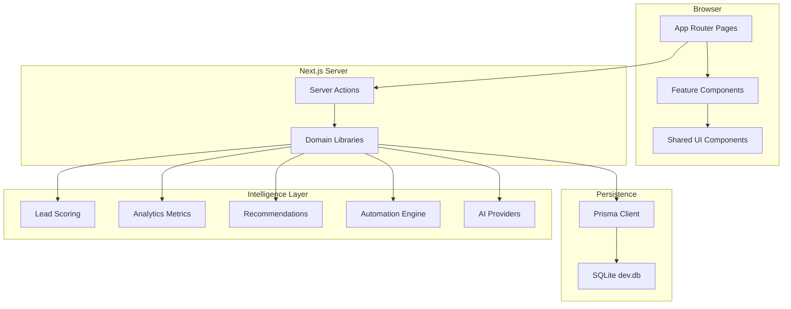
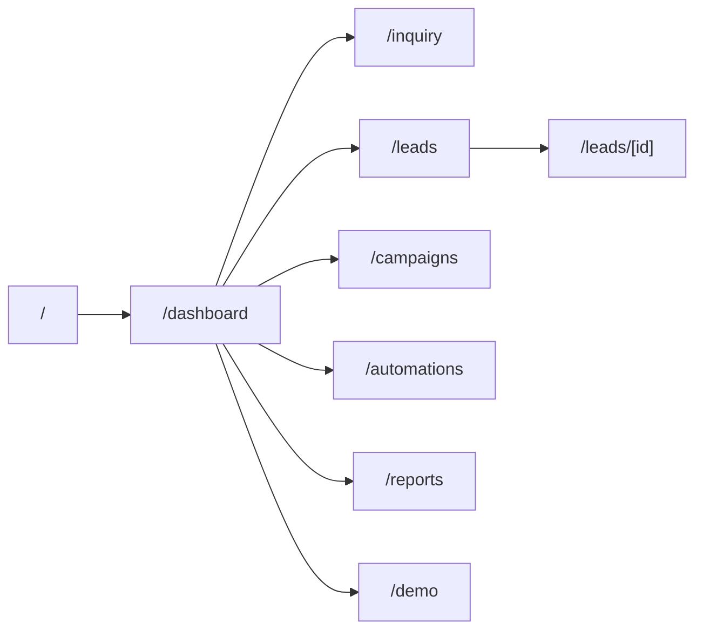
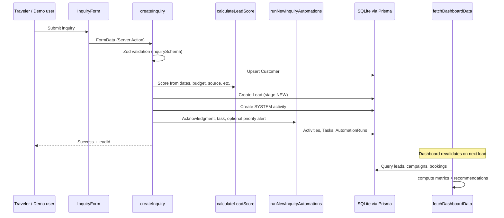
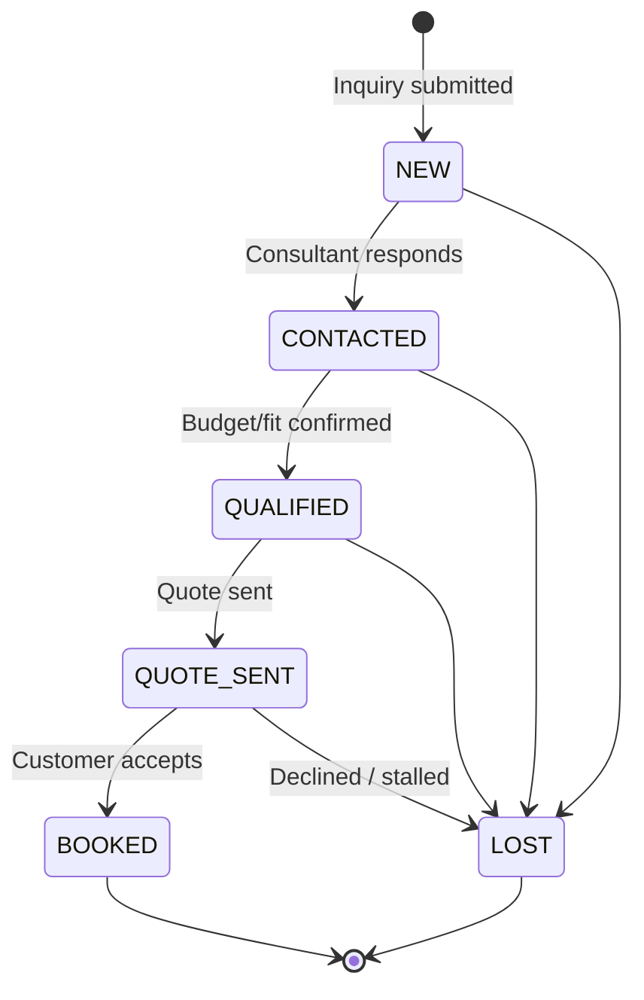
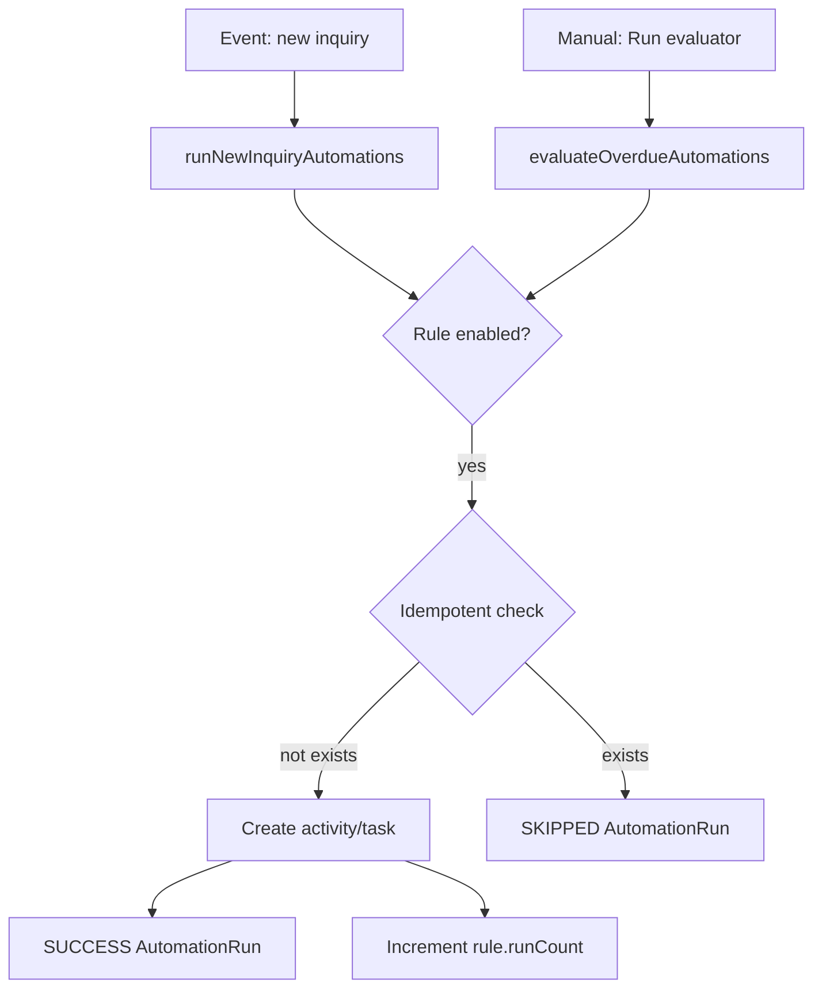
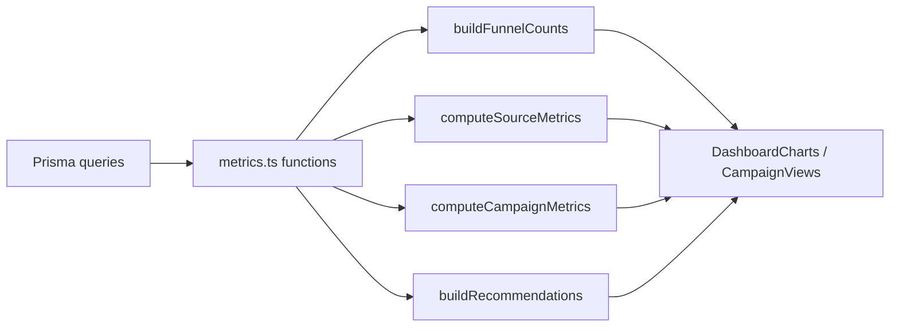
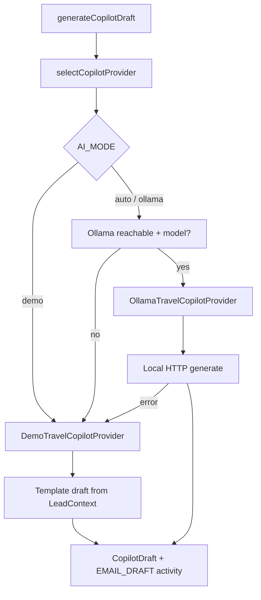
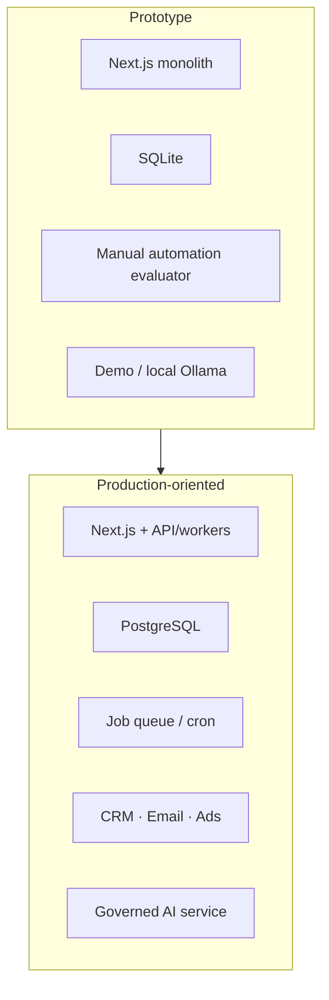

# Architecture

TravelFlow Growth OS is a **monolithic Next.js 15 application** with server-side data access through Prisma and SQLite. The UI is a single workspace shell with feature modules for dashboard, leads, campaigns, automations, reports, inquiry capture, and demo guidance.

> **Disclaimer:** This prototype is a hypothesis based on JSP Media's public services and a conversation about travel clients. It is not presented as an assumption about a specific client or role. A real engagement would begin with discovery, current-system review, requirements, success metrics, scope, and client approval.

---

## High-level component architecture

### Directory layout

| Path | Role |
|------|------|
| `src/app/` | Routes, layouts, Server Actions |
| `src/features/` | Page-specific UI (dashboard charts, leads pipeline, copilot panel) |
| `src/components/` | Reusable layout and UI primitives |
| `src/lib/` | Domain logic: analytics, automations, scoring, AI, validation |
| `prisma/` | Schema, migrations via `db push`, seed script |
| `tests/` | Vitest unit/integration, Playwright E2E |

There is **no separate API route layer** in this prototype. Mutations and reads for interactive flows go through **Server Actions** and server components that call Prisma directly.

---

## Application shell and routing

`AppShell` provides left navigation, Horizon Trails branding, and **Demo Workspace / Demo AI Mode** badges. All authenticated-workspace pages share this shell via `src/app/layout.tsx`.

---

## Data flow: inquiry to dashboard

### Inquiry workflow details

1. **Validation** — `src/lib/validation/inquiry.ts` validates name, email, dates, budget, trip type, interests, consent.
2. **Customer** — Match by email or create new; update phone/contact preference if returning email.
3. **Scoring** — `calculateLeadScore()` returns 0–100 score and factor list stored on the lead.
4. **Assignment** — Random consultant from `CONSULTANTS` constant.
5. **Lead creation** — Stage `NEW`; interests serialized as JSON string.
6. **Timeline** — `Inquiry submitted` system activity.
7. **Automations** — `runNewInquiryAutomations()` (idempotent):
   - Acknowledgment activity (no real email)
   - Follow-up task due within `FOLLOW_UP_HOURS` (default 24h)
   - Priority notification if score ≥ 75
8. **Cache** — `revalidatePath` for `/leads` and `/dashboard`.

Consultant actions on lead detail (`updateStage`, `addNote`, `createQuote`, `createBooking`, copilot) follow the same pattern: validate → Prisma write → activity log → revalidate.

---

## Lead pipeline and consultant workflow

**First response tracking:** When stage moves off `NEW`, if `firstResponseAt` is null it is set to `now`. This feeds **Average First Response Time** on the dashboard.

**Views:** Leads page supports table and kanban-style pipeline (`LeadsPipeline`) with shared filters.

---

## Automation design

Automations are **operational guardrails**, not autonomous customer messaging.

### Rule catalog

| Rule | Trigger (conceptual) | Action |
|------|---------------------|--------|
| New inquiry acknowledgment | `lead.created` | ACKNOWLEDGMENT activity |
| New inquiry follow-up task | `lead.created` | Task due within SLA |
| High-priority notification | `lead.created && score >= 75` | PRIORITY_NOTIFICATION activity |
| Uncontacted overdue | `NEW` + no firstResponse past threshold | OVERDUE_REMINDER (idempotent) |
| Quote unanswered | `QUOTE_SENT` past threshold | Follow-up task + activity |
| Booking review request | `tripCompletedAt` set | REVIEW_REQUEST draft activity |
| Previous customer re-engagement | Returning + stale activity | REENGAGEMENT suggestion |

### Execution model

- **Immediate rules** run inside `createInquiry` via `runNewInquiryAutomations`.
- **Time-based rules** run when an admin clicks **Run evaluator** on `/automations` (`evaluateOverdueAutomations`).
- **Idempotency** — Duplicate checks on activity type, task title, etc., prevent double acknowledgments or duplicate overdue reminders.
- **Audit** — Every run creates an `AutomationRun` with `SUCCESS`, `SKIPPED`, or `FAILED`.
- **Configuration** — Rules can be toggled enabled/disabled in the UI; SLA hours via environment variables.

**Limitation:** There is no cron/queue. Overdue detection does not run until the evaluator is invoked.

---

## Analytics design

### Data sources

| Input | Used for |
|-------|----------|
| Leads (filtered by date, source, destination) | Funnel, qualified counts, response time |
| Bookings (filtered by `bookedAt`) | Revenue, confirmed bookings, ROAS numerator |
| Campaigns (all) | Spend aggregation by channel |
| Lead relations (quotes, bookings, customer.isReturning) | Source/campaign metrics, new vs returning |

### Pipeline

**Recommendations** (`recommendations.ts`) are rule-based narrative cards driven by thresholds—for example slow average response (>12h), weak ROAS campaigns (spend ≥ $2,000 and ROAS < 1.2x), quote-stage drop-off, top destination revenue, returning vs new booking rates.

**Default date window:** Last 90 days ending today unless query params override.

See [METRICS.md](./METRICS.md) for exact formulas.

---

## AI provider design

| Mode | Behavior |
|------|----------|
| `auto` (default) | Try Ollama; fall back to demo |
| `demo` | Always use template provider |
| `ollama` | Prefer Ollama; fall back to demo if unavailable |

**Draft types:** `INQUIRY_SUMMARY`, `NEXT_ACTION`, `INITIAL_RESPONSE`, `ITINERARY`, `QUOTE_FOLLOW_UP`, `REENGAGEMENT`

**Safety labeling:** All demo drafts append a review footer. UI shows provider mode. No automatic send path exists.

**Limitation:** Ollama output quality depends on local model; no RAG over live supplier inventory or pricing.

---

## Failure handling

| Scenario | Behavior |
|----------|----------|
| Invalid form input | Zod errors returned to client; no DB write |
| Lead not found | Action returns `{ ok: false, message }` |
| Automation already applied | `SKIPPED` run logged; no duplicate side effects |
| Ollama unreachable | Silent fallback to Demo AI Mode |
| Ollama request throws | `runCopilot` catches and retries with demo provider |
| Division by zero in metrics | `safeDivide` returns `null`; UI shows "—" |
| Missing seed lead (E2E) | Playwright test skips Maya copilot check |

There is no global error boundary productization or retry queue for failed automations in this prototype.

---

## Security considerations (prototype scope)

**Current state:**

- No authentication or session management
- No CSRF tokens beyond Next.js Server Action defaults
- SQLite file on disk with no encryption at rest
- `.env` gitignored; `DATABASE_URL` required locally
- No rate limiting on inquiry form
- AI drafts may echo PII from lead records into SQLite

**Before production:**

- Add authN/authZ, tenant isolation, and audit trails
- Move secrets to a managed store; never commit `.env`
- Sanitize and minimize PII sent to LLM providers
- HTTPS-only deployment, CSP headers, input sanitization for stored HTML
- Consent and retention policies for marketing data
- Separate staging/production databases

---

## Production evolution

Reasonable evolution path for a JSP Media client engagement:

1. Replace SQLite with PostgreSQL and formal migrations
2. Extract automation evaluator to scheduled workers
3. Integrate CRM as system of record (sync leads both ways)
4. Connect email provider with send-only after human approval
5. Import campaign spend from ad APIs or CSV pipelines
6. Add auth, roles (consultant vs manager vs admin)
7. Introduce observability and on-call alerts for integration failures

---

## Key design principles embodied in code

1. **Human in the loop** — Automations log and task; AI drafts; nothing auto-sends to customers
2. **Transparent scoring** — Factor strings stored on each lead, not black-box ML
3. **Honest demo data** — Seeded patterns (e.g., Instagram lower conversion, referral strength) support realistic dashboard stories
4. **Minimal scope** — Server Actions over microservices; SQLite over managed infra for local demo velocity

---

## Related documents

- [METRICS.md](./METRICS.md) — KPI definitions
- [DEMO_SCRIPT.md](./DEMO_SCRIPT.md) — Live walkthrough
- [INTERVIEW_QA.md](./INTERVIEW_QA.md) — Scope and tradeoff Q&A
- [BUILD_REPORT.md](./BUILD_REPORT.md) — Implementation checklist
